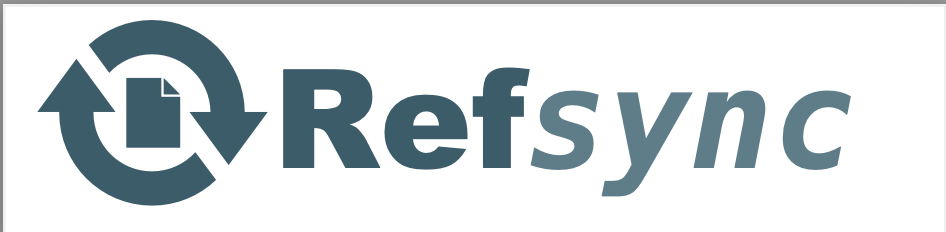

# RefSync

A citation manager for astronomers with seamless NASA ADS integration.



## Features

- **Paper Library**: Import papers from arXiv, organize with shelves and tags [coming soon: import from ADS]. Explore papers via cards, lists, multifactor filtering, or search across titles, abstracts, authors, or personal notes. 
- **Image Headers**: Attach (soon: choose) figures or images from papers to serve as card headers, for finding that one plot you remember
- **ADS Sync**: One-click sync to update arXiv preprints with published journal info: any preprints published to journal in the interim get new citation bibtex with updated information
- **BibTeX Export**: Export citations in bibtex form for individual papers, collections, or any filtered set of papers, either to clipboard or `.bib` file. Bibtex are referenced via convenient Author:Year format.
- **Dark Mode**: Easy on the eyes for those late-night paper sessions
- **Starred Papers**: Mark important papers for quick access

## Installation

Install from source:

Recommended: create an environment: 
```
mamba create -n refsync pip
mamba activate refsync
```

```bash
git clone https://github.com/prappleizer/refsync.git
cd refsync
pip install -e .
```

## Quick Start

```bash
# Start the server (opens browser automatically)
refsync

# Or specify host/port
refsync --host 0.0.0.0 --port 8080

# Don't open browser
refsync --no-browser
```

Then visit http://localhost:8000 in your browser.

## Configuration

### Data Location

By default, RefSync stores data (e.g., your personal library) in `~/.refsync/`. You can change this:

```bash
export REFSYNC_DATA_DIR=/path/to/your/data
refsync
```
(or update your shell profile for permanent changes).

### NASA ADS API Key

To sync citations with NASA ADS:

1. Get a free API key from [ADS](https://ui.adsabs.harvard.edu/user/settings/token)
2. Go to Settings in RefSync
3. Enter your API key (stored encrypted locally)

## Usage

### Adding Papers

1. Go to "Add Paper"
2. Paste an arXiv URL or ID (e.g., `2301.07041` or `https://arxiv.org/abs/2301.07041`)
3. Click "Fetch" to preview
4. Add to shelves, tags, set reading status. Optionally upload an image to represent the paper in card headers.
5. Click "Add to Library"

### Syncing with ADS

1. Configure your ADS API key in Settings
2. Go to Library
3. Click "Sync with ADS"
4. Papers that have been published will be updated with journal info

### Exporting BibTeX

- **Single paper**: Click "Copy BibTeX" on the paper detail page
- **Multiple papers**: Use filters in Library, then click "Export BibTeX"

From here either copy to clipboard, or export to a `.bib` file.

## License

MIT License - see [LICENSE](LICENSE) for details.

## Acknowledgments

- [NASA ADS](https://ui.adsabs.harvard.edu/) for their excellent API
- [arXiv](https://arxiv.org/) for open access to preprints